# NetEase-Cloud-Music-Applet (音乐播放器微信小程序)
## 项目介绍

基于[网易云音乐](https://music.163.com/#/download)真实接口开发的原生小程序。

Native applet based on NetEase cloud music real interface development.


官方API：https://163-music-api-doc.heheda.top

Official API: https://163-music-api-doc.heheda.top


含接口安装地址与接口文档。

Contains interface installation address and interface documentation.

## 使用方法
### 本项目依赖于@Binaryify所编写的后端接口
### 项目api地址：https://docs.neteasecloudmusicapi.binaryify.com/#/
### 项目git地址：https://github.com/Binaryify/NeteaseCloudMusicApi
注：不支持线上项目，仅支持本地演示

1.需要使用node命令运行后端，默认为3000端口

2.本项目基于微信小程序，建议下载后运行微信小程序版本，请使用iPhone6体验效果比较好

3.本项目仅供个人学习研究使用,请尊重网易云版权，请勿利用此项目与从事商业行为或进行破坏版权行为

### 环境要求
微信小程序
NodeJS 14+环境
网易云API后端接口(https://github.com/Binaryify/NeteaseCloudMusicApi)

### 运行后端接口
```sh
# 下载源码/切换到目录下/安装依赖
$ git clone git@github.com:Binaryify/NeteaseCloudMusicApi.git
$ cd NeteaseCloudMusicApi
$ npm install

或者

# 下载源码/切换到目录下/安装依赖
$ git clone https://github.com/Binaryify/NeteaseCloudMusicApi.git
$ cd NeteaseCloudMusicApi
$ npm install
```

```sh
# 运行
$ node app.js
或者
npm start
```

## 功能列表
- [x] 用户首页
- [x] 热门歌手
- [x] 热搜列表
- [x] 搜索功能
- [x] 最新音乐
- [x] 歌手介绍
- [x] 歌曲播放
- [x] 歌词滚动
- [x] 个人中心
- [x] 排行榜页面
- [x] 歌手热门歌曲
- [x] 歌单专辑介绍
- [x] 切换上一首/下一首
- [x] 搜索（包含单曲/歌单/视频/歌手/专辑）
- [x] 歌曲切换播放模式（随机播放/单曲循环/顺序播放）

## 技术栈
- 微信原生小程序开发
- WX组件 & API: 使用原生架构建设
- ajax：发起http请求
- ES6：采用ES6语法。
- HTML5: 项目主体结构搭建
- JavaScript: 对网页行为进行编程
- CSS3：CSS3动画及样式。


- 项目目录结构

```html
    mo_music                        // 沫音乐
    ├── components                  // 组件
    ├── netease_api        		    // Node版本网易云音乐接口
    ├── pages                       // 小程序页面
    │       └── index                 // 首页
    │       └── login                 // 登录页
    │       └── personal              // 个人中心
    │       └── recommendSong         // 每日推荐
    │       └── search                // 搜索页
    │       └── songDetail            // 音乐详细页
    │       └── video                 // 视频页
    ├── utils                       // 工具
    │       └── request.js            // 请求封装体
    ├── static                      // 静态资源/图片
    ```


## 预览效果
## Home
| 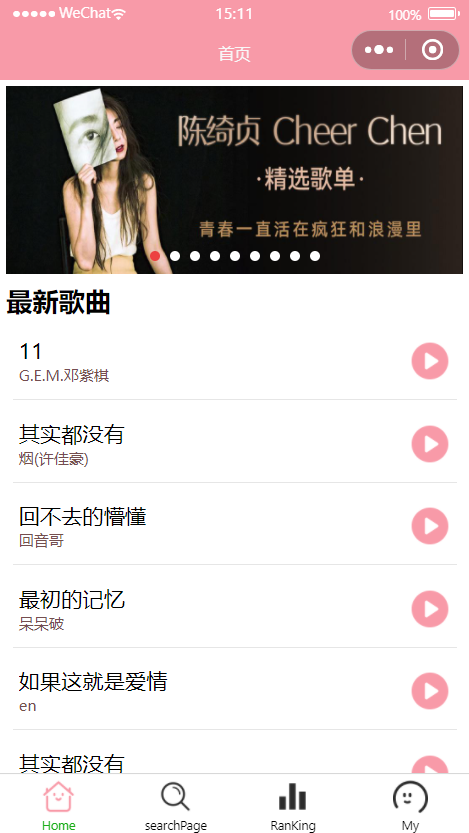 | 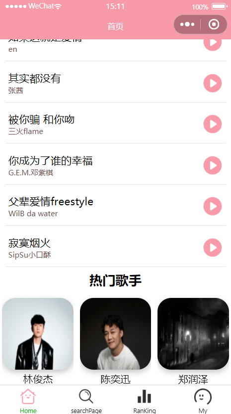 |

## Play
| | 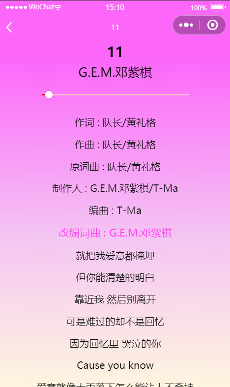 |

## SearchPage
| 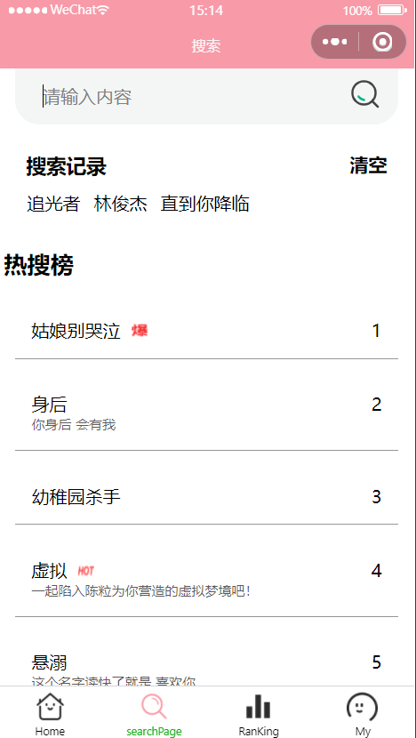 | 
 | 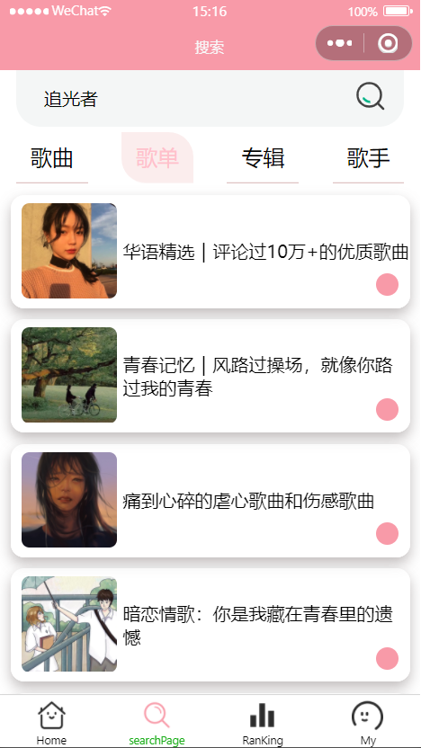 |
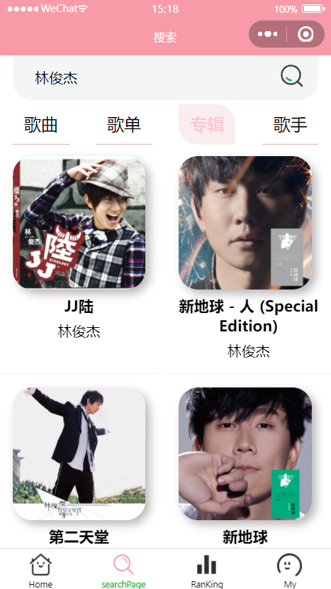 |  |

## SingerMessage
|  | 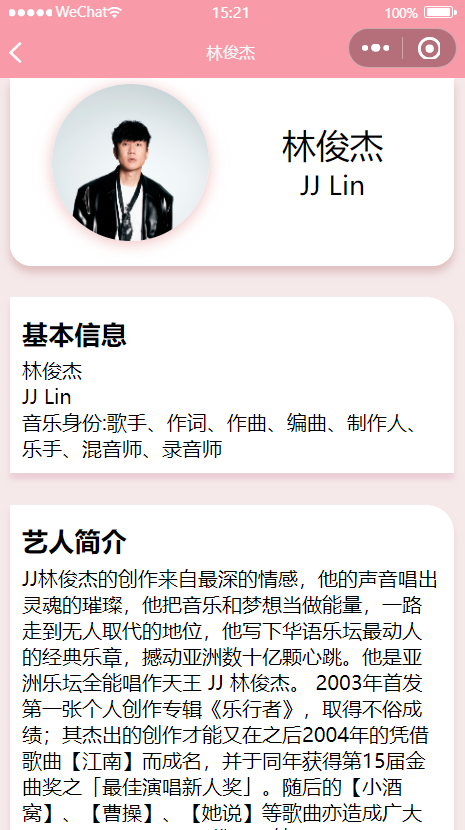 |

## ListPage
| 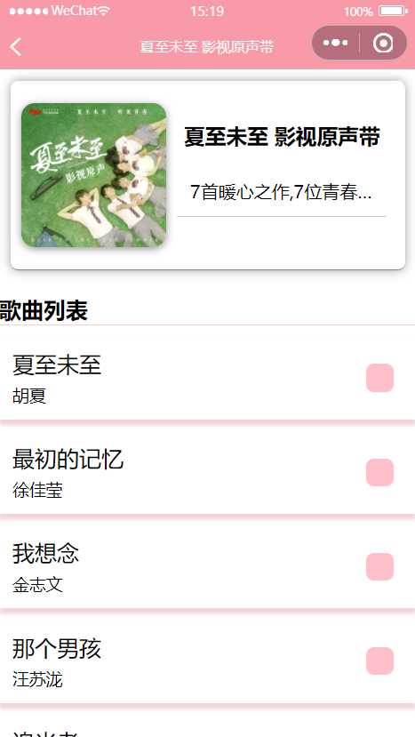 |  |
## RanKingListPage
| 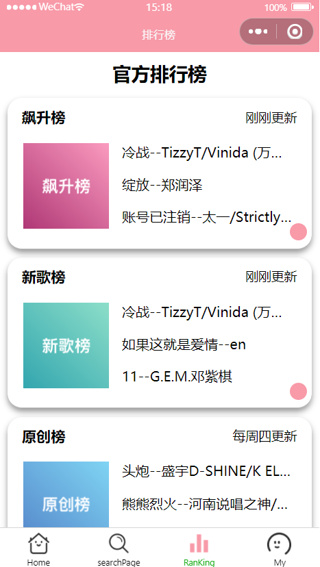 | 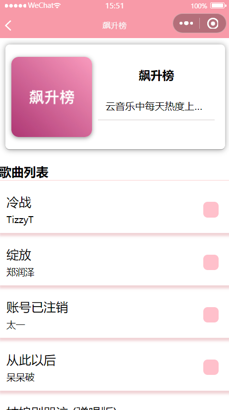 |

## MyPage
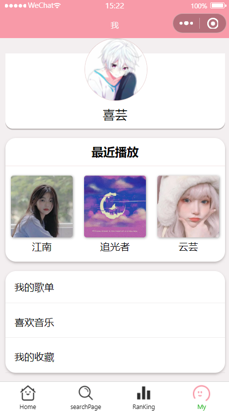
